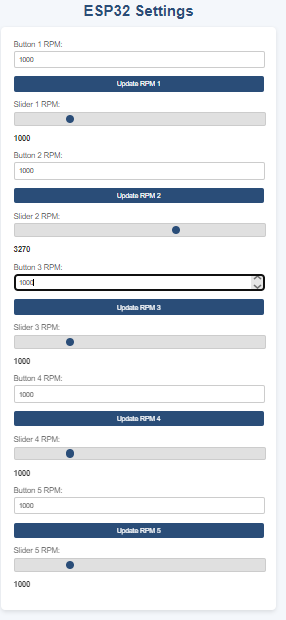

# ESP32 Webpage Project

This project demonstrates hosting a responsive webpage using the ESP32 and the ESP-IDF framework. The webpage features sliders and buttons to dynamically update values on the ESP32 in real time.

## Features

- **Wi-Fi Access Point**: The ESP32 hosts a hotspot with a predefined SSID and password.
- **Interactive Webpage**: Accessible at `http://miata.local` with sliders and buttons for real-time control.
- **SPIFFS Support**: Stores and serves webpage files directly from the ESP32.

## Prerequisites

- ESP32 development board.
- [ESP-IDF](https://docs.espressif.com/projects/esp-idf/) installed.
- A serial terminal for debugging.

## How It Works

1. **NVS Initialization**: Non-volatile storage setup.
2. **SPIFFS**: Hosts webpage files.
3. **Wi-Fi**: Creates an access point.
4. **Web Server**: Serves files and processes user input.
